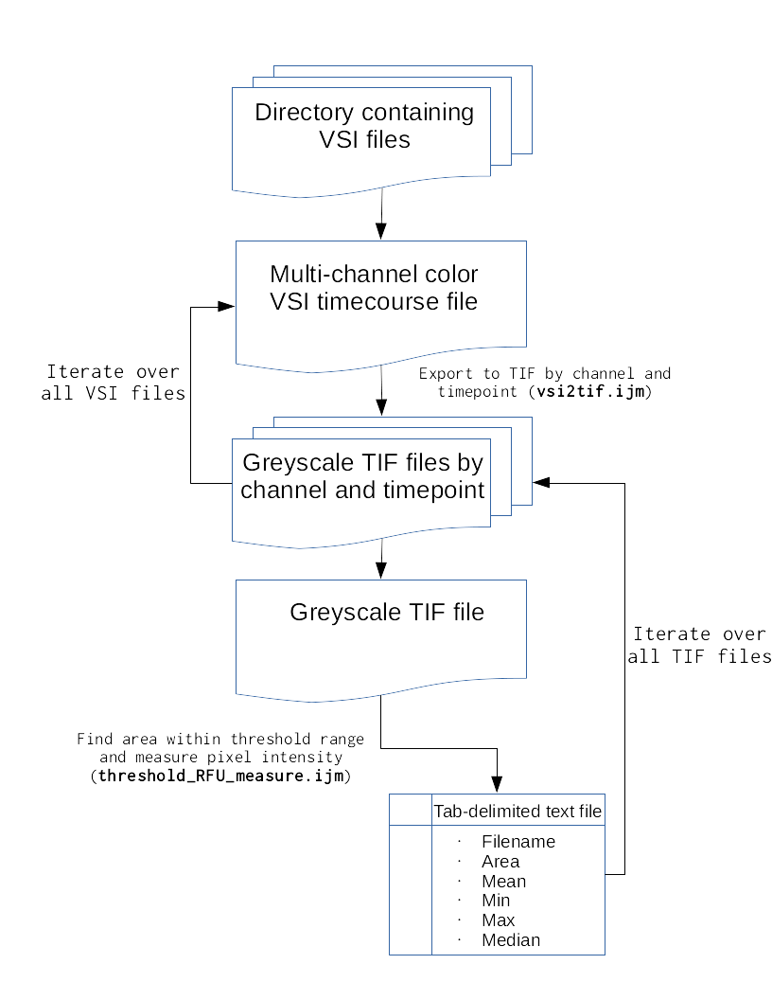

# How to use this software

This repository contains a set of scripts designed to convert time-lapse VSI-format microscopy images into a table containing the mean, median, minimum, and maximum intensity of all the pixels falling within a given signal range for each channel and each timepoint.

## Basic usage

``` shell
./src/barrier-pipeline.sh /path/to/vsi_files/ /path/to/deposit/results/ 
```

## Application in a server environment
In the server environment there is typically no graphical display available. This presents a problem for our pipeline, as ImageJ will trigger an error if there is no screen to display images on despite the fact that none of the operations in this script require graphical display. 

An easy workaround is to create a 'fake' graphical display - essentially a data sink that ImageJ can send graphical data to without disrupting operation of the server. This is done using the unix software [xvfb](https://packages.debian.org/sid/xvfb).

``` shell
xvfb-run -a ./src/barrier-pipeline.sh /path/to/vsi_files/ /path/to/deposit/results/ 
```

## Expected Results
The directory `/path/to/deposit/results/` will contain a tab-delimited text file named `vsi_files_treshold_results.txt` where "vsi_files" is replaced with the name of the directory containing the VSI files. The results file itself will have the following format: 

``` shell
Filename	            Area	    Mean	        Min	Max	Median
HIO_065_C0_T0.vsi.tif	0.013930214	192.355233447	155	255	196
HIO_065_C0_T10.vsi.tif	0.014101776	193.067333192	155	255	195
HIO_065_C0_T11.vsi.tif	0.013981844	192.295419008	155	255	194
```

Here, the VSI filename is used to generate the tif output filename which contains important metadata. `HIO_065` is the name of the VSI file; `C0` is the channel; `T0` is the timepoint number. Multiply the timepoint number by the interval between images (e.g. T3 @ 20 min intervals = 60 minutes).

## Changing the analysis parameters
In the future I may implement a system to supply options at the CLI invocation of `./src/barrier-pipeline.sh`. For now, the easiest way to change the area threshold minumim is to edit `./src/threshold_RFU_measure.ijm` directly.

``` javascript
filename = getArgument;

function fitc(filename) {
    open(filename);
    run("8-bit");
    setAutoThreshold("Default dark");
	\\ REPLACE '155' WITH THE NEW MINUMIM VALUE
    setThreshold(155, 255);
    run("Set Measurements...",
	 "area mean min median limit display redirect=None decimal=9");
    run("Measure");
}

fitc(filename);
exit();
run("Close");
run("Quit");
eval("script", "System.exit(0);");
```

## How it works

